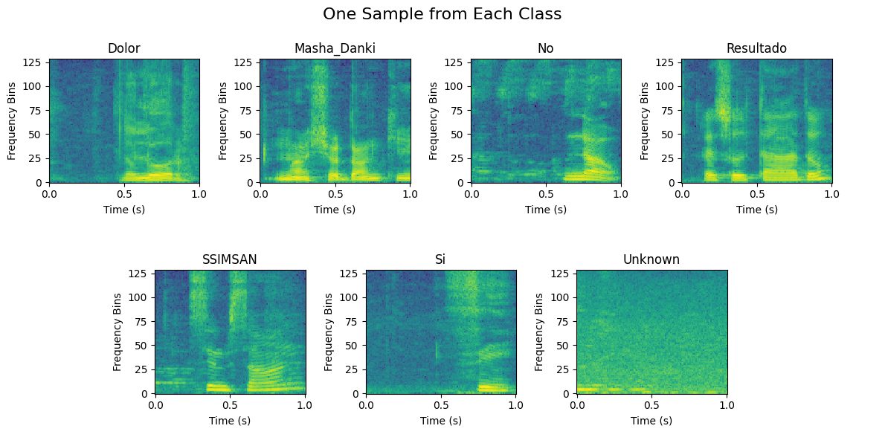

# Code Repository for "Speech-to-text model for keyword spotting applications in the Papiamento language within a healthcare environment"

Joel Rajnherc and collaborators • Bachelor Thesis Project • SISSTEM • UARC • University of Aruba

---
[](https://www.python.org/downloads/release/python-313/) [](https://www.python.org/downloads/release/python-311/) [](https://opensource.org/licenses/Apache-2.0) <a target="_blank" href="https://colab.research.google.com/github/University-of-Aruba/papiamento-keyword-spotting/blob/main/notebook/papiamento-keyword-spotting.ipynb"></a>

## 🧭 Overview
This repository accompanies the bachelor thesis by Joel Rajnherc entitled _"Speech-to-text model for keyword spotting applications in the Papiamento language within a healthcare environment"_. The goal of the thesis was to explore a [keyword spotting model](https://mlsysbook.ai/contents/labs/shared/kws_feature_eng/kws_feature_eng.html) for the Papiamento language, which is spoken in Aruba, Bonaire, and Curaçao. An aspirational and sustainble goal is the creation of end-to-end AI voice interfaces in Papiamentu or Papiamento that can be embedded in various applications, including accessibility and healthcare.

The repository provides an implementation in PyTorch through a runnable notebook and linkage with the remote dataset. This is a classification task, trained on a dataset of almost 280 participants, containing a total of 16766 spectrogram arrays, each one second long, with six different keywords in Papiamento. Additionally, it includes an unknown class for samples that do not contain any of the keywords.



<table style="max-width: 800px; margin: auto;">
    <tr>
        <td align="center">Dolor</td>
        <td align="center">Masha Danki</td>
        <td align="center">No</td>
        <td align="center">Resultado</td>
        <td align="center">SSImSan</td>
        <td align="center">Si</td>
        <td align="center">Unknown</td>
    </tr>
    <tr>
        <td>
            <video src='https://github.com/user-attachments/assets/87e71ef1-55ab-43a1-bd0a-c440b9128951'/>
        </td>
        <td>
            <video src='https://github.com/user-attachments/assets/a0fd4af3-a14f-47d4-9c20-3a4a8050fb7d'/>
        </td>
        <td>
            <video src='https://github.com/user-attachments/assets/4efa18fe-6c28-47cf-9f4d-dc8a7bcfbac5'/>
        </td>
        <td>
            <video src='https://github.com/user-attachments/assets/ee08b93d-6c6d-4ffa-9f91-5829fb766399'/>
        </td>
        <td>
            <video src='https://github.com/user-attachments/assets/dda074fa-500e-4cb0-a25b-8d3af54185f3'/>
        </td>
        <td>
            <video src='https://github.com/user-attachments/assets/b217aa05-b104-4857-aa87-1349e1f96c53'/>
        </td>
        <td>
            <video src='https://github.com/user-attachments/assets/d92bcc2c-8bd2-477b-a81b-58368d98aa08'/>
        </td>
    </tr>
</table>

---

Our first PyTorch attempt with the dataset achieved a **97.14%** test-set accuracy using a baseline convolutional neural network (CNN).

> [!IMPORTANT] 
> **Think you can beat that?** We warmly invite fellow students and researchers to take on the challenge: improve the model, experiment with new techniques, and push the boundaries of keyword spotting in Papiamento. If you manage to set a new state-of-the-art, submit a pull request and claim your spot in the leaderboard (see further below)!

> [!NOTE]
> The dataset is also separately available on Zenodo at the following address: [Zenodo Dataset](https://zenodo.org/record/1234567).

<br>

## ⚡ Quick start
Simply <a target="_blank" href="https://colab.research.google.com/github/University-of-Aruba/papiamento-keyword-spotting/blob/main/notebook/papiamento-keyword-spotting.ipynb"></a> that provides a free-tier compute environment.

<br>

## 🛠️ Setup locally in four steps

1. Clone this repository:
   ```bash
   git clone https://github.com/University-of-Aruba/papiamento-keyword-spotting.git
   cd papiamento-keyword-spotting
   ```

2. Create a Python virtual environment using the command line interface:
   <details>
   <summary>click to see instructions for Bash or Powershell...</summary>
   
   for `python`:
    
   ```bash
   python -m venv .venv
   ```
   
   or `python3`:
   
   ```bash
   python3 -m venv .venv
   ```
   
   , then activate it on Linux/macOS with
   
   ```bash
   source .venv/bin/activate
   ```
   
   or on Windows (PowerShell) with
   
   ```powershell
   .\.venv\Scripts\Activate.ps1
   ```
   
   . In case of access issues in PowerShell, run
   
   ```powershell
   Set-ExecutionPolicy Unrestricted -Scope Process
   ```
    
   then retry activating the environment.
   </details>

3. Install dependencies:
   
   ```bash
   pip install -r requirements.txt
   ```

4. Start Jupyter:

   from the command line 
   ```bash
   jupyter notebook
   ```
   which opens a browser at the address of your local Jupyter server. From there, open the file under `notebook/papiamento-keyword-spotting.ipynb`. Alternatively, you can open this file from your preferred code editor with Jupyter support (e.g., VS Code).

<br>

## 🪪 License and citation

This project is licensed under the Apache License 2.0 - see the [LICENSE](LICENSE) file for details.  If you use this repository, accompanying dataset, or thesis, please cite it as follows:

```bibtex
@thesis{rajnherc2025papiamento,
  author       = {Rajnherc, Joel Riven}, 
  type         = {Bachelor's Thesis},
  title        = {Speech-to-text model for keyword spotting applications in the Papiamento language within a healthcare environment},
  organization = {University of Aruba},
  year         = {2025},
  month        = {April}
}
```

<br>

## 🏆 Leaderboard

The following contributors have pushed the boundaries of Papiamento keyword spotting. Beat the current best, contribute a pull request. 🪇

<table>
  <thead>
    <tr>
      <th>Rank</th>
      <th>Contributor</th>
      <th>Improvement</th>
      <th>Accuracy</th>
      <th>Date Submitted</th>
    </tr>
  </thead>
  <tbody>
    <tr>
      <td>🥇 1</td>
      <td><a href="https://github.com/CringeElectrcityLord"> <strong>@CringeElectrcityLord</strong></a></td>
      <td>Baseline</td>
      <td>97.14%</td>
      <td>2025-07-02</td>
    </tr>
  </tbody>
</table>

<br>

## 🤝 Contributing
We’re calling on the community: improve the model, test new ideas, and advance Papiamento keyword spotting. Submit a pull request. If you've managed to set a new benchmark you will earn your place at the top!

> [!IMPORTANT]
> Please take note of the following guidelines:
> * All entries must include reproducible code and results.
> * The standard seed of 42 is used.
> * Please clear all notebook outputs before submitting your changes.
> * **We will not review notebooks with outputs.**

<br>

## 🤗 Acknowledgements

- All the participants that contributed to the data collection!
- All the stakeholders, including but not limited to Full Stack Vision Aruba (Raspberry PI Foundation), ImSan, FHTMS, and Esther Plomp from the University of Aruba Research Center.
- The thesis supervisor Francis Laclé, co-evaluators Dr. Salys Sultan, Dr. Eric Mijts, and external readers Peter Scholing and John Becker.
- The thesis was heavily inspired by [tinyMLedu](https://github.com/tinyMLx), [Speech Commands: A Dataset for Limited-Vocabulary Speech Recognition](https://arxiv.org/pdf/1804.03209), and [open-speech-recording](https://github.com/petewarden/open-speech-recording).
- A special shout out to Jean-Luc at SISSTEM for providing help with data filtering.

<br>

> [!NOTE]
> A Python port of the C++ version of Pete Warden's [extract_loudest_section](https://github.com/petewarden/extract_loudest_section) tool is available [here](https://github.com/University-of-Aruba/extract_loudest_section_python).

<br>

Crafted with ❤️ and FAIRness.
